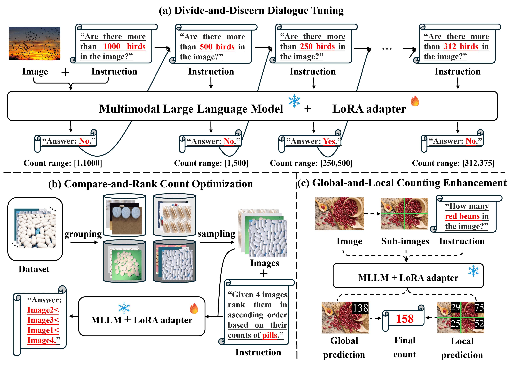

# Bootstrapping MLLM for Weakly‑Supervised Class‑Agnostic Object Counting (WS-COC)

This repository hosts the official implementation of the paper:  
**Bootstrapping MLLM for Weakly‑Supervised Class‑Agnostic Object Counting**  
(OpenReview: [link](https://openreview.net/forum?id=QUE0CuClXe), arXiv: [link](https://arxiv.org/abs/2602.12774))



## 📰 News

- **[2026.01]** 🚀 Our paper is accepted by **ICLR 2026**!
- **[2026.04]** 🔥 Training and inference code are released!
- **[2026.04]** 📦 Pre-trained LoRA weights are available.

## ⚙️ Environment Setup

### 1. Create Conda Environment

```bash
conda create -n ws_coc python=3.10 -y
conda activate ws_coc
```

### 2. Install PyTorch (CUDA 11.8)

```bash
pip install torch==2.4.0 torchvision==0.19.0 torchaudio==2.4.0 --index-url https://download.pytorch.org/whl/cu118
```

### 3. Install LLaVA-NeXT

This project depends on the [LLaVA-NeXT](https://github.com/LLaVA-VL/LLaVA-NeXT) library (included as a submodule). Install it in development mode:

```bash
git clone https://github.com/LLaVA-VL/LLaVA-NeXT
cd LLaVA-NeXT
pip install --upgrade pip  # Enable PEP 660 support.
pip install -e ".[train]"
cd ..
```

### 4. Install Other Dependencies

```bash
pip install -r requirements.txt
```

## ⚙️ Training

### 1. Prepare Dataset

First, download the **FSC-147 dataset** from its official repository: [Learning To Count Everything](https://github.com/cvlab-stonybrook/LearningToCountEverything). Extract and place it in  directory following this structure:

```text
data/FSC/
├──FSC_147/
    ├── annotation_FSC147_384.json
    ├── Train_Test_Val_FSC_147.json
    ├── ImageClasses_FSC147.txt
├── data/FSC/gt_density_map_adaptive_384_VarV2/
└── images_384_VarV2/
    ├── 2.jpg
    ├── 6.jpg
    └── ...
LLaVA-NeXT/
FSC.py
infer.py
prepare_instruct_data.py
requirements.txt
train.sh
...
```

Then, generate the JSON corpus for fine-tuning based on the FSC-147 dataset:

```bash
python prepare_instruct_data.py
```

### 2. Train Model with LoRA

Use the LLaVA-NeXT training script to fine-tune the model with the generated JSON corpus. You can use the provided bash script to launch deepspeed training:

```bash
bash train.sh
```

> We provide pre-trained LoRA weights for convenience. You can download them here: [OneDrive](https://1drv.ms/f/c/63af628aa5beb906/IgAnMnMCCjriSo4vjANGWZgzAXSkc0efVlLi3LNStCN21GU?e=dQj22D)

### 3. Merge LoRA Weights

After training, merge the LoRA weights back into the original base model:

```bash
python LLaVA-NeXT/scripts/merge_lora_weights.py \
    --model-path "path-to-lora-weights" \
    --model-base "path-to-base-model" \
    --save-model-path "path-to-save-model" 
```

## ⚙️ Inference

### Test the Model

Use `infer.py` and the merged model weights for testing. You can run the provided inference script:

```bash
python infer.py  --pretrained_model "path-to-model" 
```

## 🙏 Acknowledgements

This project is built upon the excellent work and codebases from [LLaVA-NeXT](https://github.com/LLaVA-VL/LLaVA-NeXT) and [CounTR](https://github.com/Verg-Avesta/CounTR). We sincerely thank the authors and contributors of these projects for their outstanding open-source contributions.

## 📝 Citation

If you find our work or this code useful in your research, please consider citing our paper accepted at **ICLR 2026**:

```bibtex
@inproceedings{zhang2026bootstrapping,
  title={Bootstrapping MLLM for Weakly-Supervised Class-Agnostic Object Counting},
  author={Zhang, Xiaowen and Yue, Zijie and Luo, Yong and Zhao, Cairong and Chen, Qijun and Shi, Miaojing},
  booktitle={The Fourteenth International Conference on Learning Representations},
  year={2026}
}
```
